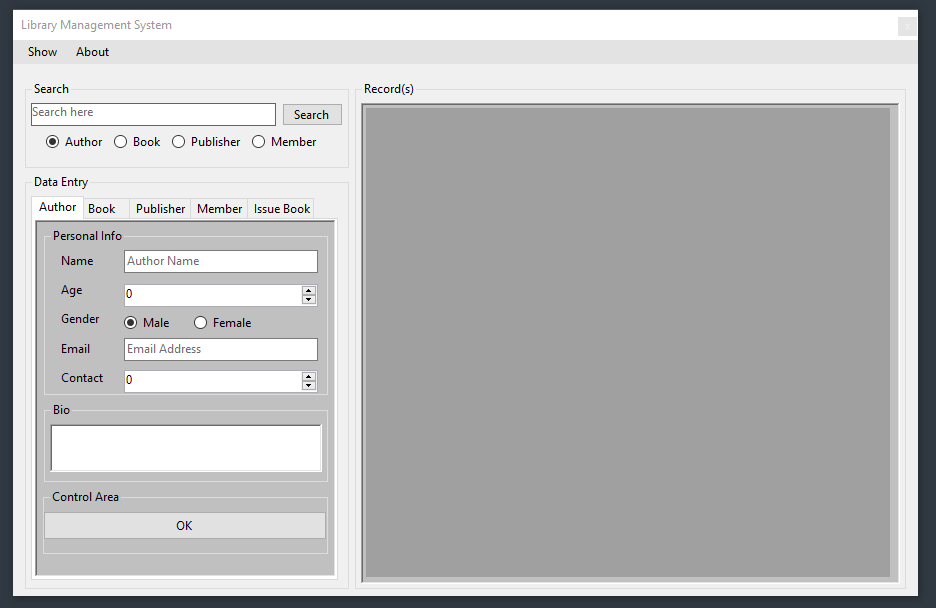
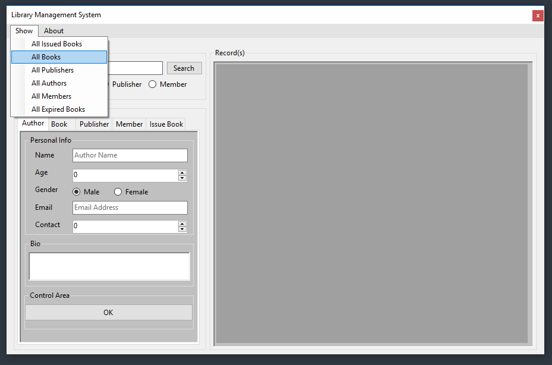
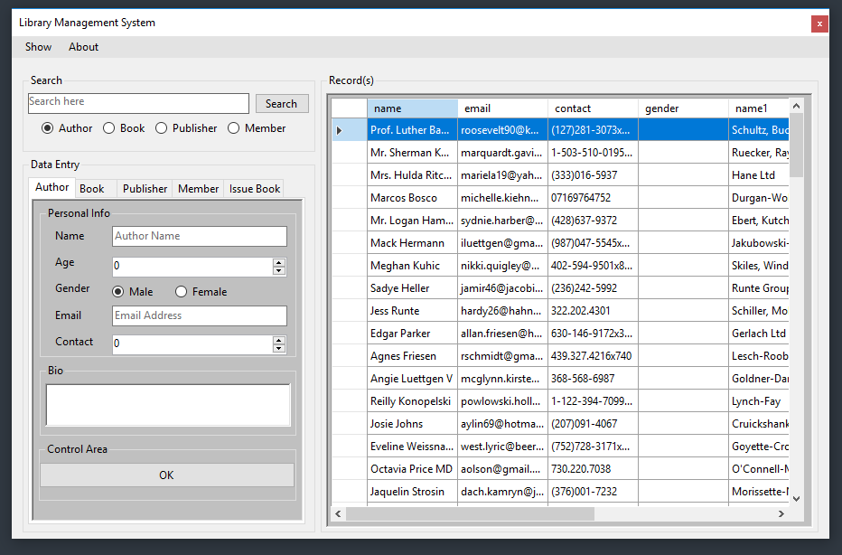

# Library CMS
> A simple library management system.

# #Getting Started
> Import the [Database](https://github.com/mediocre9/library-cms/tree/main/Database) in XAMPP and download **Mysql** connector extension to build the project.

## Build Previews:

